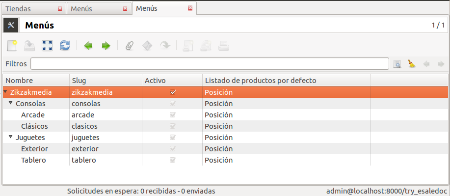
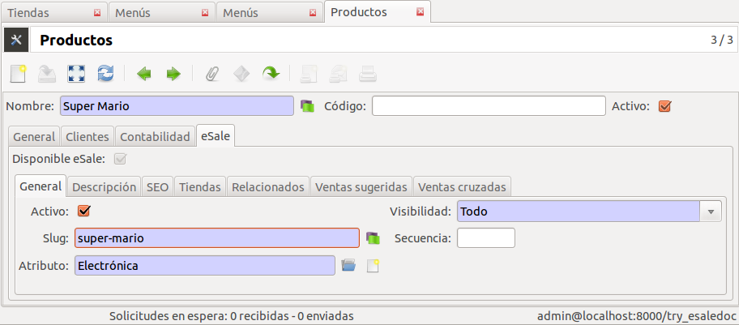

=================================
Productos de comercio electrónico
=================================

.. inheritref:: product_esale/product_esale:section:menus

Menús
-----

Tryton permite el diseño de categorías/menús del árbol de navegación de la
tienda en línea.

* Padre. Categoría padre para el árbol de navegación.
* Slug. Campo para SEO de las direcciones web. Debe ser único.
* Slug Completo. La dirección completa del menú de navegación (campo funcional)

.. inheritref:: product_esale/product_esale:section:productos

Productos
---------

El módulo eSale Product añade una nueva pestaña en la ficha de productos para
la gestionar aquéllos destinados al comercio electrónico. Los productos para
comercio electrónico necesitan unos campos extras como Slug, ventas cruzadas,
visibilidad,...

* |esale_active|: Si se muestra y permite su venta.
* |esale_slug|: Campo para SEO de las direcciones web. Debe ser único en la tienda que
  desea vender ese producto.
* |esale_visibility|: Donde se muestra ese producto.
* |esale_sequence|: Orden de visualización del producto en listados (opcional)
* |esale_shortdescription|: Descripción de 512 caracteres. Se muestra como textos
  introducción o listados.
* |esale_description|: Descripción venta (detalles). Puede usar tags HTML aunque
  se recomienda el uso de `RST <http://docutils.sourceforge.net/docs/ref/rst/directives.html>`_
* SEO: Campos no requeridos pero que los buscadores agraceden:

  * |esale_metakeyword|
  * |esale_metatitle|
  * |esale_metadescription|

* |esale_saleshops|: Tiendas que tendrán disponible este producto. Por defecto se asignan
  a todas las tiendas activas. Si no desea publicar ese producto en una tienda
  concreta, elimínela de la lista.
* |esale_relateds|: Productos relacionados.
* |esale_upsells|: Productos que le proponen cuando realice una venta.
* |esale_crosssells|: Productos que le proponen para las ventas.

.. |esale_active| field:: product.template/esale_active
.. |esale_slug| field:: product.template/esale_slug
.. |esale_visibility| field:: product.template/esale_visibility
.. |esale_sequence| field:: product.template/esale_sequence
.. |esale_shortdescription| field:: product.template/esale_shortdescription
.. |esale_description| field:: product.template/esale_description
.. |esale_metakeyword| field:: product.template/esale_metakeyword
.. |esale_metatitle| field:: product.template/esale_metatitle
.. |esale_metadescription| field:: product.template/esale_metadescription
.. |esale_saleshops| field:: product.template/esale_saleshops
.. |esale_relateds| field:: product.template/esale_relateds
.. |esale_upsells| field:: product.template/esale_upsells
.. |esale_crosssells| field:: product.template/esale_crosssells

.. note:: Sólo podrá activar productos para el comercio electrónico si
          previamente activa que éstos sean vendibles. En el momento que marque
          que ese producto es vendible, podrá decidir si se permite la venta
          on-line.

.. note:: El proceso de activación para la venta on-line de un producto es
          irreversible. Una vez activada la opción de disponible para el
          comercio electrónico, no lo podrá eliminar. Para no vender este
          producto o para ocultar, desactive el campo **Activo** de la pestaña
          **eSale/General** o establezca la **Visibilidad** a **Ninguno**.
